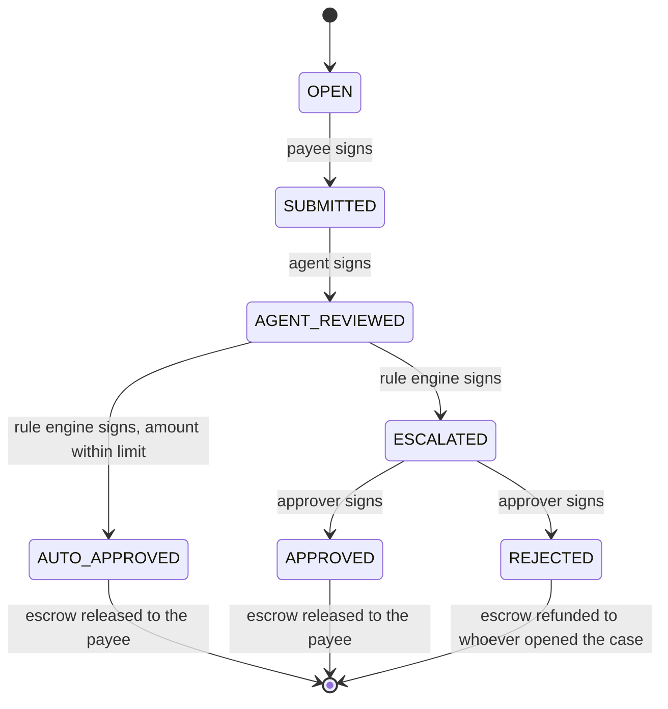
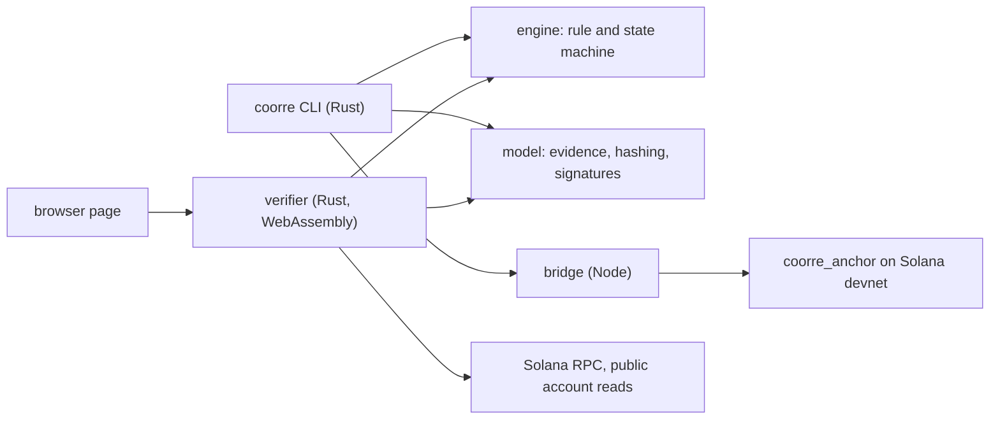

<h1 align="center">
<picture>
<source media="(prefers-color-scheme: dark)" srcset="docs/assets/hero-dark.svg">

</picture>
</h1>

<p align="center">


</p>

The agent acts within its mandate, the rule decides, and a person signs every exception. On Solana, the program enforces the limit and releases a payment only when the evidence-backed decision is anchored. Anyone can verify every step without trusting us.

Built for the Colosseum Crypto World's Fair, Solana track, by watafluxhackteam.

## The problem

AI agents are moving from recommending to deciding: Gartner expects at least 15% of day-to-day work decisions to be made autonomously through agentic AI by 2028, up from 0% in 2024 ([Gartner, June 2025](https://www.gartner.com/en/newsroom/press-releases/2025-06-25-gartner-predicts-over-40-percent-of-agentic-ai-projects-will-be-canceled-by-end-of-2027)). Governance is not keeping pace: 97% of leaders worldwide and 95% in Brazil plan to adopt agentic AI within two years, yet only 21% worldwide and 27% in Brazil report mature governance models ([Deloitte, State of AI in the Enterprise 2026](https://www.deloitte.com/br/pt/about/press-room/state-of-ai-2026.html)). And projects stall without controls: Gartner also predicts that over 40% of agentic AI projects will be canceled by the end of 2027 because of escalating costs, unclear business value or inadequate risk controls ([Gartner, June 2025](https://www.gartner.com/en/newsroom/press-releases/2025-06-25-gartner-predicts-over-40-percent-of-agentic-ai-projects-will-be-canceled-by-end-of-2027)). And a limit that lives in configuration can be switched off: in the ACFE's 2026 study of occupational fraud, the override of existing internal controls was the primary weakness in 19% of cases, and the lack of internal controls in 33% ([ACFE, 2026](https://www.acfe.com/report-to-the-nations)).

## What has to be true

Autonomy is worth granting only when it can be bounded, overruled and audited. The OWASP Top 10 for Agentic Applications already names rogue agents and identity and privilege abuse among the main risks ([OWASP, December 2025](https://genai.owasp.org/2025/12/09/owasp-top-10-for-agentic-applications-the-benchmark-for-agentic-security-in-the-age-of-autonomous-ai/)). Three conditions follow:

- **Bound what an agent can do.** Singapore's Model AI Governance Framework for Agentic AI asks organisations to assess and bound risks upfront by placing limits on what agents can do, and to weigh each action by how reversible it is ([IMDA, 2026](https://www.imda.gov.sg/resources/press-releases-factsheets-and-speeches/factsheets/2026/updated-model-ai-governance-framework-for-agentic-ai)).
- **A person owns every exception with material impact.** The same framework calls for checkpoints that require human approval for high-stakes or irreversible actions, and lists making payments among them. The EU AI Act requires that the people overseeing a high-risk system can decide not to use it, override or reverse its output, and interrupt it ([EU AI Act, Article 14](https://artificialintelligenceact.eu/article/14/)).
- **Every automated decision can be explained and re-checked.** Brazil's LGPD gives people the right to request review of decisions taken solely on automated processing and to receive clear information on the criteria and procedures used ([LGPD, Article 20](https://www.planalto.gov.br/ccivil_03/_ato2015-2018/2018/lei/l13709.htm)). In a field study of 75 AI initiatives in 22 Brazilian companies, decision-making and direction was the largest group of bottlenecks, present in 33% of the initiatives, and the study concludes that the more autonomy agents have, the more they need controls, a record of activity and human supervision; the authors state that the sample is not statistically representative ([StartSe Consulting, reported by Mundo RH, October 2026](https://mundorh.com.br/ia-nas-empresas-84-dos-projetos-analisados-apresentam-resultados-e-revelam-novos-desafios-para-o-rh/)).

## What already exists, and what is missing

The rails for agent payments are already here. Google's Agent Payments Protocol (AP2) uses cryptographically signed Mandates, backed by verifiable credentials, as proof of what a user authorized, including price limits ([Google Cloud, September 2025](https://cloud.google.com/blog/products/ai-machine-learning/announcing-agents-to-payments-ap2-protocol/?hl=en)). x402 is an open payment protocol that supports Solana mainnet and devnet ([x402](https://docs.x402.org/faq)). Solana Payment Channels let an agent deposit a spending ceiling into on-chain escrow and authorize each request with a signed message instead of a transaction ([Solana](https://solana.com/payment-channels)).

These rails answer how an agent pays. They do not prove that a payment which needed judgment was decided under the right rule, with the right evidence, by someone with the authority to decide. That is the layer CoorRe adds. It complements the rails: the proven decision is what a rail can act on.

## How CoorRe works

Every case is a payment held in escrow and a decision that has to be proven before it moves.

| Role | Who | What it can do |
|---|---|---|
| Payee | The supplier, provider or grantee that is owed the payment | Submits the evidence. Receives the escrow when the decision is proven. |
| AI agent | A pre-analysis agent | Reads the evidence and recommends. It cannot approve anything or move funds. |
| Rule engine | A deterministic system | Applies the rule named in the evidence and decides within the mandate. Above the limit, the program refuses its approval. |
| Human approver | A designated person with authority | Signs every exception, approving or rejecting an escalated case with a justification. |

1. **The agent recommends.** It reads what the payee submitted and records its advice, signed with its own key.
2. **The rule decides within the mandate.** The rule engine applies a deterministic rule to the evidence. If every condition holds and the amount is within the autonomy limit, the case is approved and the escrow is released. Otherwise it escalates, with one reason per failed condition.
3. **A person signs the exception.** Only the approver's key can take an escalated case to approved or rejected. The program checks every signer against the role stored on-chain.

Each step is a W3C Verifiable Credential, the data model published as a W3C Standard in May 2025 ([W3C, May 2025](https://lists.w3.org/Archives/Public/w3c-news/2025AprJun/0000.html)), signed by the actor and anchored on Solana by its hash. The documents stay off-chain.

Money in CoorRe is always a payment owed for a delivery or a decision. It is escrowed when a case opens, released to the payee when the decision is proven and anchored, and refunded to whoever opened the case when the decision is a rejection. There is no trading, no pricing, no orders, no markets and no speculation. The payment is the consequence; the product is the proven decision.

## One case, end to end

SUP-002 is a supplier payment of 0.20 SOL where the automation is allowed to approve up to 0.10 SOL. The supplier's environmental license has expired. This is the sequence that ran on Solana devnet, with synthetic data.

<p align="center">
<picture>
<source media="(prefers-color-scheme: dark)" srcset="docs/assets/flow-sup002-dark.svg">

</picture>
</p>

Orange appears twice: when the program refuses an approval above the mandate, and on the human signature, the only way past the limit.

## What anyone can verify

Every step is a signed credential whose hash is anchored on Solana. The verifier takes a bundle of those credentials and the original documents, reads the accounts from the chain, and runs seven checks. It runs on the command line and in the browser, from the same Rust code.

<p align="center">
<picture>
<source media="(prefers-color-scheme: dark)" srcset="docs/assets/verify-checks-dark.svg">

</picture>
</p>

| Check | What it proves |
|---|---|
| 1. Artifact digests | Each file matches the hash its evidence declares. |
| 2. Evidence hashes | Every credential hashes to the value that was anchored. |
| 3. Signatures | Each credential carries a valid Ed25519 proof (W3C eddsa-jcs-2022). |
| 4. Signer binding | The key that signed is the role key stored on-chain for that step. |
| 5. Hash chain | The steps form one unbroken chain from the case to its final state. |
| 6. On-chain match | The accounts belong to the CoorRe program and hold exactly the recomputed values. |
| 7. Decisions reproduced | The verifier re-runs the rule named in the evidence, from the registry it ships, on the submitted documents and gets the recorded decision. |

Check 7 closes a gap the chain cannot: the program enforces the amount against the mandate, but it cannot read documents. If a compromised rule engine approved a case whose license had expired, checks 1 to 6 would still pass and check 7 would fail. The verifier only runs rules it ships: a decision that names any other rule, version or hash fails check 7. See [ADR-004](docs/decisions/ADR-004-reproducible-automated-decisions.md) and [ADR-005](docs/decisions/ADR-005-rule-registry-and-application-domains.md).

## Where it applies

The program, the roles, the state machine and the evidence model stay the same in every domain. What changes is the rule, and each rule ships in the verifier's registry with synthetic demo cases: one that passes and one that needs the approver.

| Domain | Who acts | Evidence | Rule | Human authority | Anchor | Status |
|---|---|---|---|---|---|---|
| Supplier onboarding and payment | Supplier, procurement agent, rule engine | Tax certificate, environmental license | supplier-docs v1 | Procurement manager | [StartSe Consulting, 2026](https://mundorh.com.br/ia-nas-empresas-84-dos-projetos-analisados-apresentam-resultados-e-revelam-novos-desafios-para-o-rh/) | runs on devnet |
| Milestone payments in funded projects, with accountability | Grantee organisation, review agent, rule engine | Funding agreement, milestone report, accountability report | milestone-payment v1 | Fund manager | [Law 13.019/2014, Art. 48](https://www.planalto.gov.br/ccivil_03/_ato2011-2014/2014/lei/l13019compilado.htm) | runs on devnet |
| Payments for ecosystem services with monitoring evidence | Provider on the land, monitoring agent, rule engine | Contract, monitoring report | ecosystem-services-payment v1 | Program manager | [Law 14.119/2021, Art. 6, § 6](https://www.planalto.gov.br/ccivil_03/_ato2019-2022/2021/lei/l14119.htm) | runs on devnet |
| Service contracts delivered by consultancies | Consultancy, review agent, rule engine | Service contract, acceptance record, invoice | service-delivery v1 | Contract manager | [Law 4.320/1964, Arts. 62 and 63](https://www.planalto.gov.br/ccivil_03/leis/l4320.htm), when the client is a public body | runs on devnet |
| Purchases prepared by AI agents | Supplier, purchasing agent, rule engine | Purchase request, supplier quote, supplier registration | agent-purchase v1 | Purchasing manager | [AP2](https://cloud.google.com/blog/products/ai-machine-learning/announcing-agents-to-payments-ap2-protocol/?hl=en), [IMDA](https://www.imda.gov.sg/resources/press-releases-factsheets-and-speeches/factsheets/2026/updated-model-ai-governance-framework-for-agentic-ai), [StartSe Consulting](https://mundorh.com.br/ia-nas-empresas-84-dos-projetos-analisados-apresentam-resultados-e-revelam-novos-desafios-para-o-rh/) | runs on devnet |

**Payments for ecosystem services.** This is where the Re of CoorRe stands for regenerative; it grows out of W.A.T.A, the earlier payments-for-ecosystem-services project co-founded by Ramon Porto.

## Under the hood

<details>
<summary>State machine enforced by the program</summary>



Each transition must be signed by the key of the role that owns it. The four role keys of a case must be distinct.

</details>

<details>
<summary>Rule registry</summary>

Each rule is a JSON document in [offchain/crates/coorre-engine/rules](offchain/crates/coorre-engine/rules), compiled into the engine and the verifier and identified by the SHA-256 of its canonical form. A rule approves only when every condition holds; otherwise it escalates with one reason per failed condition, in the order the rule lists them, and the mandate check always comes last.

| Rule | Documents | Demo cases |
|---|---|---|
| supplier-docs v1 | tax certificate, environmental license | SUP-001, SUP-002, SUP-003 |
| agent-purchase v1 | purchase request, supplier quote, supplier registration | AGT-001, AGT-002 |
| ecosystem-services-payment v1 | contract, monitoring report | PES-001, PES-002 |
| milestone-payment v1 | funding agreement, milestone report, accountability report | MIL-001, MIL-002 |
| service-delivery v1 | service contract, acceptance record, invoice | SRV-001, SRV-002 |

The cases and their synthetic documents are described in [demo/fixtures](demo/fixtures/README.md).

</details>

<details>
<summary>Architecture</summary>



The Rust core has no Solana dependency. The Node bridge is the only component that sends transactions, and it refuses any network other than devnet. Evidence stays off-chain; only hashes and public keys reach the chain.

</details>

## Try it

You need Rust (stable) and Node 20 or later. These commands verify a recorded devnet case against the live chain. They need no keys and no SOL.

```bash
git clone https://github.com/catitodev/CoorRe.git
cd CoorRe
npm ci --prefix bridge
cargo build --release --manifest-path offchain/Cargo.toml -p coorre-cli
offchain/target/release/coorre verify \
  --bundle web/verifier/samples/SUP-002/bundle.json \
  --artifacts web/verifier/samples/SUP-002/artifacts
```

The command prints the seven checks and exits with status 1 if any fails. Change one byte of a file in the artifacts folder and run it again to see checks 1 and 7 fail. The same command verifies the AGT-002 and PES-002 samples, recorded on devnet under agent-purchase v1 and ecosystem-services-payment v1.

The four other domains also run offline, with no keys and no network. This test takes the eight cases through the in-memory simulator, verifies each one 7/7 and checks that one changed byte in any document fails checks 1 and 7:

```bash
cargo test --manifest-path offchain/Cargo.toml -p coorre-cli --test domains_offline
```

<details>
<summary>Run the tests and the demo</summary>

```bash
cargo test --manifest-path offchain/Cargo.toml --workspace
npm test --prefix bridge
npm test --prefix web/verifier
```

The `web/verifier` tests need the WebAssembly build first: `WASM_BINDGEN=/path/to/wasm-bindgen scripts/build-verifier`.

The narrated demo opens real cases on devnet. It needs five Solana key files in `.local/keys` (creator, submitter, agent, rule_engine, approver) with mode 600 and some devnet SOL in the creator key:

```bash
offchain/target/release/coorre demo run
```

With the same key files, any case runs narrated and offline, with nothing sent to a network:

```bash
offchain/target/release/coorre demo run --offline --case AGT-002 --case MIL-002
```

</details>

## On-chain proof

The program is deployed on Solana devnet:

- Program: [`9esN1A8K1SASLg17ob81dbSdB4VX8ozc6tBLmJ247Wv`](https://explorer.solana.com/address/9esN1A8K1SASLg17ob81dbSdB4VX8ozc6tBLmJ247Wv?cluster=devnet)
- Deploy transaction: [`2ku5UxeT…`](https://explorer.solana.com/tx/2ku5UxeTyM1qrVcKhB3s68pDVh2cZyyTpFXuhF8orWjzvswoCguiN5AjoLAAvbxLbG6yRBDHvxgAFYKzcsq7JJxY?cluster=devnet)

<details>
<summary>Transactions of the SUP-002 case</summary>

| Step | Transaction |
|---|---|
| OPEN, 0.20 SOL escrowed | [`rBt7urt2…`](https://explorer.solana.com/tx/rBt7urt2sexKvv4kYWKfXCam54wxJsq46Zjs8hiV1HL2rWt8VJMMQKW8BB4HGxiMbirGzofe4CzHLbLh5GhascB?cluster=devnet) |
| SUBMITTED | [`3eduiGPv…`](https://explorer.solana.com/tx/3eduiGPv3z2KbVNicNovUKYcvJn5UYMEhhhRcwsNB7g9D8bDNpWgT8JPy2sbqmZwK4ujEaGuX4WmkM577JUEy8LN?cluster=devnet) |
| AGENT_REVIEWED | [`4tb5Us6g…`](https://explorer.solana.com/tx/4tb5Us6gM4dMkyHrFSVLBXWDme5ATisEW5QADx5NRibGeZb4fMg5HG6exgX4cyCpNADV6JAUVrPzZLUo4YwzpxZi?cluster=devnet) |
| AUTO_APPROVED attempted above the limit | Rejected by the program with `MandateExceeded`. No transaction exists. |
| ESCALATED | [`3zQBE5sY…`](https://explorer.solana.com/tx/3zQBE5sYP5GyqazDYLh445kPeCWmWDBewRHFYsNjJKWye8Q28nFDeMnL4whmmWzmDTPwfZqXxgbZAdg3ZySmNQd2?cluster=devnet) |
| APPROVED, escrow released | [`2nQ2pHJ7…`](https://explorer.solana.com/tx/2nQ2pHJ7ACi6LQeNSzDAhM2N2ji9kkAZEmgsfTghSNNToQizXVXwkZiR3Ejiz2jwmiz8FUZMR3hG6RUDW1aapfYc?cluster=devnet) |

More deployment details and the SUP-001 case are in [onchain/DEPLOYMENTS.md](onchain/DEPLOYMENTS.md).

</details>

<details>
<summary>Cases of the four other domains (devnet, 2026-10-10)</summary>

| Case | Rule | Case record | Final step |
|---|---|---|---|
| AGT-001 | agent-purchase v1 | [`HFkXBQAZ…`](https://explorer.solana.com/address/HFkXBQAZsR5fv9ydjUHGhSzjcbxi4qFNAdz3tVoguVDV?cluster=devnet) | AUTO_APPROVED, escrow released: [`3rTeiVAQ…`](https://explorer.solana.com/tx/3rTeiVAQN8MbEKrGJ5E9f1zbhd2tRLHqG35uDuGkLmcZAMTWpK5WfczpfpxysZ4htvevSN1qksPac3QYmkVvJFkY?cluster=devnet) |
| AGT-002 | agent-purchase v1 | [`4tkhyE96…`](https://explorer.solana.com/address/4tkhyE96rDPd3hCZvxge8i5sYNGmkH4SAsdK5SgJFeQz?cluster=devnet) | APPROVED, escrow released: [`NmdtA5YR…`](https://explorer.solana.com/tx/NmdtA5YRW1nBTmiBqEQJSpitnMQyQLpUZXSGNUTFJ6fSQR9WTXtkrEM54drMT3tavcFvxV221SFpPN9icqGvBmn?cluster=devnet) |
| PES-001 | ecosystem-services-payment v1 | [`6VKegWgg…`](https://explorer.solana.com/address/6VKegWgguGwfoqpSkgWYCViqPjsvwqv5uX4vRFbVRGsT?cluster=devnet) | AUTO_APPROVED, escrow released: [`3uzkLCcM…`](https://explorer.solana.com/tx/3uzkLCcMmUUUkbPT3fGwmYHAr9vyxjG3zh3URbw1bP7iF6AM3WN56ePcJVUv7cdrHvAGZ3hu1DSHWg9eRVwm8LSY?cluster=devnet) |
| PES-002 | ecosystem-services-payment v1 | [`Fg7PbduC…`](https://explorer.solana.com/address/Fg7PbduC8r5KWM8WkRxqsDXfyHoqkBjM9HCaCe8csAF1?cluster=devnet) | APPROVED, escrow released: [`5WrgY3n5…`](https://explorer.solana.com/tx/5WrgY3n5ViURcBRiwV1jQvBkj2NPDevy4p6SVWyr8kVUQwMmi819yxQXAUYFxaw1jcemKRPTJrQwLPvdGLsurPLx?cluster=devnet) |
| MIL-001 | milestone-payment v1 | [`EJutNMDd…`](https://explorer.solana.com/address/EJutNMDdpkjw72S5mMbXqgkuwjjF9y7jNYgUaicLLbFJ?cluster=devnet) | AUTO_APPROVED, escrow released: [`5TMsTFEN…`](https://explorer.solana.com/tx/5TMsTFENPinNkwqeGLP6DPQJgAEyo2JNXgDxGQSoKTb7SPuvxGdJSsqwdQj64B1ekgXoWVnwV53EisF5FuJScEt3?cluster=devnet) |
| MIL-002 | milestone-payment v1 | [`G46pdzcf…`](https://explorer.solana.com/address/G46pdzcfhWgSJhiNvV36sxGussmWJ7kwaoRd3QDFpmRL?cluster=devnet) | REJECTED, escrow refunded: [`5rW4veHJ…`](https://explorer.solana.com/tx/5rW4veHJEtHiDHsQJphtp8TtvUpSyLYBMLAGBbDCbyZYLXQVUwc91fjqsqi9yNUKa4G4MAC9BodBi1PS2Gd6vrDF?cluster=devnet) |
| SRV-001 | service-delivery v1 | [`CzWgCr1H…`](https://explorer.solana.com/address/CzWgCr1HtwrHzC1Wwy4CGmkDeC6CaDrtWykrWhct9zSb?cluster=devnet) | AUTO_APPROVED, escrow released: [`2JMRXjZ6…`](https://explorer.solana.com/tx/2JMRXjZ6sRHqCKJN5p4nMAxnyESL8tgLLRqiEyQ8WJPQkaB3HaDs33TFE1DkQVqFvSU6jXosQLWDebV98YRySeAb?cluster=devnet) |
| SRV-002 | service-delivery v1 | [`DNPDxAje…`](https://explorer.solana.com/address/DNPDxAjex72NgF9xKRZdLzvywMtmBUWDU2wcTZhGzSLm?cluster=devnet) | REJECTED, escrow refunded: [`3FV3ThfP…`](https://explorer.solana.com/tx/3FV3ThfPDWuvyND9LfF8kr1XJaWFPTbgmCr2jMthh28U9NJBfek3M8TGheLK3G7pLzcizEoKfQcrCLzMnhg9Wpa4?cluster=devnet) |

AGT-002 and PES-002 also show the program rejecting an approval above the mandate with `MandateExceeded` before the case is escalated. Every step and the balances are listed in [onchain/DEPLOYMENTS.md](onchain/DEPLOYMENTS.md). The audit bundles of all eight cases are in the repository, ready for `coorre verify`: AGT-002 and PES-002 in [web/verifier/samples](web/verifier/samples), the other six in [onchain/devnet-bundles](onchain/devnet-bundles/README.md).

</details>

## Market signal

Gartner predicts that by 2030 guardian agent technologies, built to oversee what AI agents do, will account for at least 10 to 15% of agentic AI markets ([Gartner, June 2025](https://www.gartner.com/en/newsroom/press-releases/2025-06-11-gartner-predicts-that-guardian-agents-will-capture-10-15-percent-of-the-agentic-ai-market-by-2030)). It also expects spending on AI governance to reach USD 492 million in 2026 and surpass USD 1 billion by 2030 ([Gartner, February 2026](https://www.gartner.com/en/newsroom/press-releases/2026-02-17-gartner-global-ai-regulations-fuel-billion-dollar-market-for-ai-governance-platforms)); both figures signal that the category exists, not the size of CoorRe's market.

## Security and limits

The model of threats, the controls and the dependency review are in [docs/SECURITY.md](docs/SECURITY.md). The main points:

- The mandate is enforced by the program, so no operator, server or agent can approve above it.
- Rules are deterministic, and the verifier runs only the rules it ships: a decision that names any other rule, version or hash fails check 7.
- The verifier never takes the expected program from the bundle it is checking.
- Bundle content is untrusted: the browser verifier renders it as text only and runs under a strict content security policy.
- The bridge and the CLI refuse any network other than devnet and refuse key files other users can read.

Declared limits of this build:

- Devnet only, never mainnet. Demo keys are held by the operator.
- The AI agent is simulated and deterministic. No language model is called.
- All domain documents are synthetic. Check 7 proves a decision follows the rule, not that a document is genuine.
- No verifiable build and no fuzzing. The public devnet RPC rate-limits.
- The program upgrade authority is a single wallet. The production target is a Squads multisig.

## Roadmap

- Upgrade authority under a Squads multisig.
- Batch anchoring through Merkle roots.
- Solana Actions and Blinks for approver decisions.
- x402-style payments for agents.
- Documents signed by a real issuer or registry.
- Integration with agent payment rails (AP2, x402, Solana Payment Channels) as the decision layer.

## FAQ

<details>
<summary>Is CoorRe a trading or DeFi protocol?</summary>

No. Money in CoorRe is always a payment owed for a delivery or a decision: escrowed when a case opens, released to the payee when the decision is proven and anchored, and refunded to whoever opened the case when the decision is a rejection. CoorRe does not trade, price, take orders, run markets or speculate.

</details>

<details>
<summary>Why on-chain?</summary>

Because the limit has to hold even if the operator, the server or the agent is compromised. The program refuses an approval above the mandate, which a database or an API cannot guarantee. The chain also gives every step a public record with a timestamp that no single party can rewrite.

</details>

<details>
<summary>What does the AI agent actually do?</summary>

It reads the submitted documents and records a recommendation: escalate or auto-approve. It cannot approve or release anything. In this build it is simulated and deterministic: it runs the same rule as the rule engine and no language model is called. A real agent can replace it later; check 7 compares its advice with the rule, and its advice still moves no funds.

</details>

<details>
<summary>Can I verify without running anything?</summary>

Yes, with the browser verifier in [web/verifier](web/verifier), once it is published on GitHub Pages. Until then you can run it locally or use the command in Try it.

</details>

<details>
<summary>How is this different from AP2, x402 or Solana Payment Channels?</summary>

They move the money and prove what a user authorized an agent to spend. CoorRe proves the decision behind a payment that needs judgment: which rule applied, to which evidence, and who signed the exception. The two fit together, with the proven decision as the trigger a payment rail acts on; that integration is on the roadmap.

</details>

<details>
<summary>Why does the law matter here?</summary>

Because in many processes the law already conditions payment on proof. In Brazil, public spending is paid only after the creditor's right is verified against the contract and the proof of delivery or of the service provided ([Law 4.320/1964, Arts. 62 and 63](https://www.planalto.gov.br/ccivil_03/leis/l4320.htm)), payments for environmental services under the federal program depend on verified and proven actions ([Law 14.119/2021, Art. 6, § 6](https://www.planalto.gov.br/ccivil_03/_ato2019-2022/2021/lei/l14119.htm)), and installments to civil society partners are withheld when a previous one shows evidence of irregularity ([Law 13.019/2014, Art. 48](https://www.planalto.gov.br/ccivil_03/_ato2011-2014/2014/lei/l13019compilado.htm)). CoorRe turns these requirements into rules that a machine applies, a person signs when they fail, and anyone can re-check.

</details>

## Team and name

CoorRe is built and owned by its two co-founders, Clarkson Bartalini ([@catitodev](https://github.com/catitodev)), technical lead, and Ramon Porto ([@ramonzitus](https://github.com/ramonzitus)), co-founder. The hackathon team is watafluxhackteam.

Environmental and governance specialists who build their own technology: proving what happened is part of their daily work in monitoring and accountability.

Ramon Porto co-founded W.A.T.A, an earlier payments-for-ecosystem-services project that was one of the five winners of the DLT for Operations track of the [2025 Hedera Africa Hackathon](https://africa.com/2025-hedera-africa-hackathon-announces-winners-officially-becomes-the-largest-web3-hackathon-globally/). Clarkson Bartalini joined him to build the MVP and lead the development of the solution. The CoorRe proposal was selected among 200 of 1,053 ideas in Phase 1 of [Centelha RJ III](https://www.faperj.br/?id=1100.7.8) (preliminary list, September 2026).

The name is Coor(dination) + Re. Re stands for record and, for regenerative-economy partners, regenerative.

No code existed before 2026-10-07. The first commit is dated 2026-10-08 and the whole history is public. [docs/evidence/EVIDENCE_LOG.md](docs/evidence/EVIDENCE_LOG.md) records each step with its date.

## Documentation

- [Specification](docs/spec/SPEC.md)
- [Security notes and threat model](docs/SECURITY.md)
- Decisions: [ADR-001](docs/decisions/ADR-001-shared-codes-and-encodings.md), [ADR-002](docs/decisions/ADR-002-verifier-trust-anchors.md), [ADR-003](docs/decisions/ADR-003-demo-actors-and-case-references.md), [ADR-004](docs/decisions/ADR-004-reproducible-automated-decisions.md), [ADR-005](docs/decisions/ADR-005-rule-registry-and-application-domains.md)
- [Deployments and devnet results](onchain/DEPLOYMENTS.md)
- [Brand assets](docs/assets/brand.md)

## Sources

1. Gartner, "Gartner Predicts Over 40% of Agentic AI Projects Will Be Canceled by End of 2027", press release, 25 June 2025. <https://www.gartner.com/en/newsroom/press-releases/2025-06-25-gartner-predicts-over-40-percent-of-agentic-ai-projects-will-be-canceled-by-end-of-2027>
2. Deloitte, "State of AI in the Enterprise 2026", press release (3,235 business and IT leaders, 115 in Brazil, surveyed August to September 2025; the page carries no publication date). <https://www.deloitte.com/br/pt/about/press-room/state-of-ai-2026.html>
3. ACFE, "Occupational Fraud 2026: A Report to the Nations", 2026, Figure 37. <https://www.acfe.com/report-to-the-nations>
4. OWASP GenAI Security Project, "OWASP Top 10 for Agentic Applications", 9 December 2025. <https://genai.owasp.org/2025/12/09/owasp-top-10-for-agentic-applications-the-benchmark-for-agentic-security-in-the-age-of-autonomous-ai/>
5. Infocomm Media Development Authority (IMDA), Singapore, "Updated Model AI Governance Framework for Agentic AI", factsheet, 20 May 2026 (framework first launched in January 2026). <https://www.imda.gov.sg/resources/press-releases-factsheets-and-speeches/factsheets/2026/updated-model-ai-governance-framework-for-agentic-ai>
6. European Union, Artificial Intelligence Act, Article 14, Human oversight. <https://artificialintelligenceact.eu/article/14/>
7. Brazil, Law 13.709/2018 (LGPD), Article 20. <https://www.planalto.gov.br/ccivil_03/_ato2015-2018/2018/lei/l13709.htm>
8. StartSe Consulting, "IA nas Trincheiras 2026", as reported by Mundo RH, 6 October 2026 (75 initiatives, 78 agents, 22 companies, 15 sectors; not a statistically representative sample). <https://mundorh.com.br/ia-nas-empresas-84-dos-projetos-analisados-apresentam-resultados-e-revelam-novos-desafios-para-o-rh/>
9. Google Cloud, "Powering AI commerce with the new Agent Payments Protocol (AP2)", 16 September 2025. <https://cloud.google.com/blog/products/ai-machine-learning/announcing-agents-to-payments-ap2-protocol/?hl=en>
10. x402, FAQ. <https://docs.x402.org/faq>
11. Solana, Payment Channels. <https://solana.com/payment-channels>
12. W3C, "W3C publishes Verifiable Credentials 2.0 as a W3C Standard", 15 May 2025. <https://lists.w3.org/Archives/Public/w3c-news/2025AprJun/0000.html>
13. Brazil, Law 13.019/2014, Article 48, as worded by Law 13.204/2015. <https://www.planalto.gov.br/ccivil_03/_ato2011-2014/2014/lei/l13019compilado.htm>
14. Brazil, Law 14.119/2021, Article 6, paragraph 6. <https://www.planalto.gov.br/ccivil_03/_ato2019-2022/2021/lei/l14119.htm>
15. Brazil, Law 4.320/1964, Articles 62 and 63. <https://www.planalto.gov.br/ccivil_03/leis/l4320.htm>
16. Gartner, "Gartner Predicts that Guardian Agents will Capture 10-15% of the Agentic AI Market by 2030", press release, 11 June 2025. <https://www.gartner.com/en/newsroom/press-releases/2025-06-11-gartner-predicts-that-guardian-agents-will-capture-10-15-percent-of-the-agentic-ai-market-by-2030>
17. Gartner, "Global AI Regulations Fuel Billion-Dollar Market for AI Governance Platforms", 17 February 2026. <https://www.gartner.com/en/newsroom/press-releases/2026-02-17-gartner-global-ai-regulations-fuel-billion-dollar-market-for-ai-governance-platforms>
18. Africa.com, "2025 Hedera Africa Hackathon Announces Winners, Officially Becomes The Largest Web3 Hackathon Globally". <https://africa.com/2025-hedera-africa-hackathon-announces-winners-officially-becomes-the-largest-web3-hackathon-globally/> (the page lists W.A.T.A among the five winners of the DLT for Operations track and carries no publication date).
19. FAPERJ, "FAPERJ divulga lista preliminar de empresas aprovadas na Fase 1 do Programa Centelha RJ III", 1 September 2026. <https://www.faperj.br/?id=1100.7.8>

## License

Apache-2.0. See [LICENSE](LICENSE) and [NOTICE](NOTICE).
