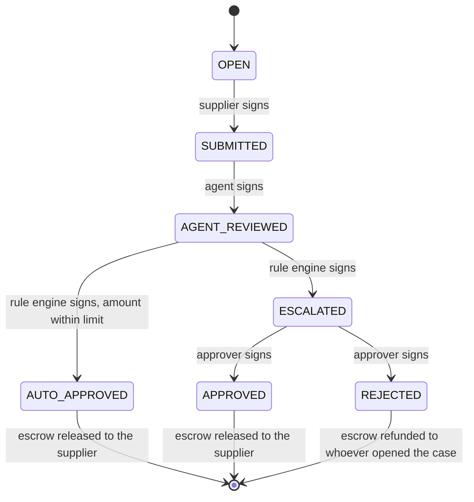
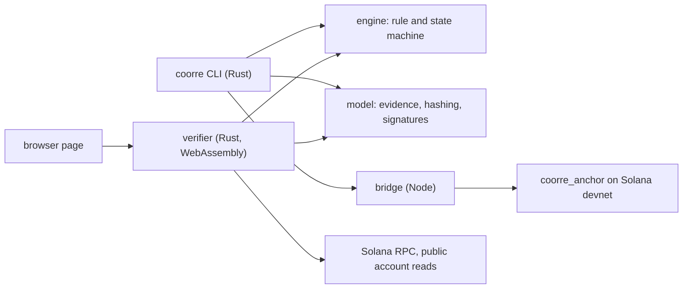

<h1 align="center">
<picture>
<source media="(prefers-color-scheme: dark)" srcset="docs/assets/hero-dark.svg">

</picture>
</h1>

<p align="center">


</p>

CoorRe lets an AI agent act inside a mandate that a Solana program enforces, and lets anyone check afterwards that it did.

- Agents may act. The Solana program enforces their mandate.
- Above the limit, a payment is released only with the signature of a designated human approver.
- Anyone can verify every step without trusting us.

Built for the Colosseum Crypto World's Fair, Solana track, by the team watafluxhackteam.

## How money works in CoorRe

Money in CoorRe is always a payment owed for a delivery or a decision. It is escrowed when a case opens, released to the supplier when the decision is proven and anchored, and refunded to whoever opened the case when the decision is a rejection.

There is no buying or selling of assets, no prices, no orders, no markets and no speculation. The payment is the consequence. The product is the proven decision.

CoorRe is verifiable coordination between people, systems and AI agents. Every case follows the same flow: event or delivery, evidence, rule or validation, decision, state, auditable trail.

## One case, end to end

SUP-002 is a supplier payment of 0.20 SOL where the automation is allowed to approve up to 0.10 SOL. The supplier's environmental license has expired. This is the sequence that ran on Solana devnet, with synthetic data.

<p align="center">
<picture>
<source media="(prefers-color-scheme: dark)" srcset="docs/assets/flow-sup002-dark.svg">

</picture>
</p>

Orange appears twice: when the program refuses an approval above the mandate, and on the human signature, the only way past the limit.

## What anyone can verify

Every step is a signed credential whose hash is anchored on Solana. The verifier takes a bundle of those credentials and the original documents, reads the accounts from the chain, and runs seven checks. It runs on the command line and in the browser, from the same Rust code.

<p align="center">
<picture>
<source media="(prefers-color-scheme: dark)" srcset="docs/assets/verify-checks-dark.svg">

</picture>
</p>

| Check | What it proves |
|---|---|
| 1. Artifact digests | Each file matches the hash its evidence declares. |
| 2. Evidence hashes | Every credential hashes to the value that was anchored. |
| 3. Signatures | Each credential carries a valid Ed25519 proof (W3C eddsa-jcs-2022). |
| 4. Signer binding | The key that signed is the role key stored on-chain for that step. |
| 5. Hash chain | The steps form one unbroken chain from the case to its final state. |
| 6. On-chain match | The accounts belong to the CoorRe program and hold exactly the recomputed values. |
| 7. Decisions reproduced | The verifier re-runs the rule on the submitted documents and gets the recorded decision. |

Check 7 closes a gap the chain cannot: the program enforces the amount against the mandate, but it cannot read documents. If a compromised rule engine approved a case whose license had expired, checks 1 to 6 would still pass and check 7 would fail. See [ADR-004](docs/decisions/ADR-004-reproducible-automated-decisions.md).

## Under the hood

<details>
<summary>State machine enforced by the program</summary>



Each transition must be signed by the key of the role that owns it. The four role keys of a case must be distinct.

</details>

<details>
<summary>Architecture</summary>



The Rust core has no Solana dependency. The Node bridge is the only component that sends transactions, and it refuses any network other than devnet. Evidence stays off-chain; only hashes and public keys reach the chain.

</details>

## Use cases

The demo uses supplier payments. The same pattern applies to procurement and supplier onboarding, contracts, accountability reports, milestone payments and environmental payments.

## Try it

You need Rust (stable) and Node 20 or later. These commands verify a recorded devnet case against the live chain. They need no keys and no SOL.

```bash
git clone https://github.com/catitodev/CoorRe.git
cd CoorRe
npm ci --prefix bridge
cargo build --release --manifest-path offchain/Cargo.toml -p coorre-cli
offchain/target/release/coorre verify \
  --bundle web/verifier/samples/SUP-002/bundle.json \
  --artifacts web/verifier/samples/SUP-002/artifacts
```

The command prints the seven checks and exits with status 1 if any fails. Change one byte of a file in the artifacts folder and run it again to see checks 1 and 7 fail.

<details>
<summary>Run the tests and the demo</summary>

```bash
cargo test --manifest-path offchain/Cargo.toml --workspace
npm test --prefix bridge
npm test --prefix web/verifier
```

The `web/verifier` tests need the WebAssembly build first: `WASM_BINDGEN=/path/to/wasm-bindgen scripts/build-verifier`.

The narrated demo opens real cases on devnet. It needs five Solana key files in `.local/keys` (creator, submitter, agent, rule_engine, approver) with mode 600 and some devnet SOL in the creator key:

```bash
offchain/target/release/coorre demo run
```

</details>

## On-chain proof

The program is deployed on Solana devnet:

- Program: [`9esN1A8K1SASLg17ob81dbSdB4VX8ozc6tBLmJ247Wv`](https://explorer.solana.com/address/9esN1A8K1SASLg17ob81dbSdB4VX8ozc6tBLmJ247Wv?cluster=devnet)
- Deploy transaction: [`2ku5UxeT…`](https://explorer.solana.com/tx/2ku5UxeTyM1qrVcKhB3s68pDVh2cZyyTpFXuhF8orWjzvswoCguiN5AjoLAAvbxLbG6yRBDHvxgAFYKzcsq7JJxY?cluster=devnet)

<details>
<summary>Transactions of the SUP-002 case</summary>

| Step | Transaction |
|---|---|
| OPEN, 0.20 SOL escrowed | [`rBt7urt2…`](https://explorer.solana.com/tx/rBt7urt2sexKvv4kYWKfXCam54wxJsq46Zjs8hiV1HL2rWt8VJMMQKW8BB4HGxiMbirGzofe4CzHLbLh5GhascB?cluster=devnet) |
| SUBMITTED | [`3eduiGPv…`](https://explorer.solana.com/tx/3eduiGPv3z2KbVNicNovUKYcvJn5UYMEhhhRcwsNB7g9D8bDNpWgT8JPy2sbqmZwK4ujEaGuX4WmkM577JUEy8LN?cluster=devnet) |
| AGENT_REVIEWED | [`4tb5Us6g…`](https://explorer.solana.com/tx/4tb5Us6gM4dMkyHrFSVLBXWDme5ATisEW5QADx5NRibGeZb4fMg5HG6exgX4cyCpNADV6JAUVrPzZLUo4YwzpxZi?cluster=devnet) |
| AUTO_APPROVED attempted above the limit | Rejected by the program with `MandateExceeded`. No transaction exists. |
| ESCALATED | [`3zQBE5sY…`](https://explorer.solana.com/tx/3zQBE5sYP5GyqazDYLh445kPeCWmWDBewRHFYsNjJKWye8Q28nFDeMnL4whmmWzmDTPwfZqXxgbZAdg3ZySmNQd2?cluster=devnet) |
| APPROVED, escrow released | [`2nQ2pHJ7…`](https://explorer.solana.com/tx/2nQ2pHJ7ACi6LQeNSzDAhM2N2ji9kkAZEmgsfTghSNNToQizXVXwkZiR3Ejiz2jwmiz8FUZMR3hG6RUDW1aapfYc?cluster=devnet) |

More deployment details and the SUP-001 case are in [onchain/DEPLOYMENTS.md](onchain/DEPLOYMENTS.md).

</details>

## Security and limits

The model of threats, the controls and the dependency review are in [docs/SECURITY.md](docs/SECURITY.md). The main points:

- The mandate is enforced by the program, so no operator, server or agent can approve above it.
- The verifier never takes the expected program from the bundle it is checking.
- Bundle content is untrusted: the browser verifier renders it as text only and runs under a strict content security policy.
- The bridge and the CLI refuse any network other than devnet and refuse key files other users can read.

Declared limits of this build:

- Devnet only, never mainnet. Demo keys are held by the operator.
- The AI agent is simulated and deterministic. No language model is called.
- The documents are synthetic. Check 7 proves a decision follows the rule, not that a document is genuine.
- No verifiable build and no fuzzing. The public devnet RPC rate-limits.
- The program upgrade authority is a single wallet. The production target is a Squads multisig.

## Roadmap

Upgrade authority under a Squads multisig, batch anchoring through Merkle roots, Solana Actions and Blinks for approver decisions, x402-style payments for agents, and documents signed by a real issuer or registry.

## FAQ

<details>
<summary>Is CoorRe a trading or DeFi protocol?</summary>

No. CoorRe does not trade, lend, price or swap anything. It escrows and releases payments that are owed, after a decision has been proven.

</details>

<details>
<summary>Why on-chain?</summary>

Because the limit has to hold even if the operator, the server or the agent is compromised. The program refuses an approval above the mandate, which a database or an API cannot guarantee. The chain also gives every step a public record with a timestamp that no single party can rewrite.

</details>

<details>
<summary>What does the AI agent actually do?</summary>

It reads the submitted documents and records a recommendation: escalate or auto-approve. It cannot approve or release anything. In this build it is simulated and deterministic: it runs the same rule as the rule engine and no language model is called. A real agent can replace it later; check 7 compares its advice with the rule, and its advice still moves no funds.

</details>

<details>
<summary>Can I verify without running anything?</summary>

Yes, with the browser verifier in [web/verifier](web/verifier), once it is published on GitHub Pages. Until then you can run it locally or use the command in Try it.

</details>

## Team and name

CoorRe is built and owned by its two co-founders: Clarkson Bartalini ([@catitodev](https://github.com/catitodev)), technical lead, and Ramon Porto, co-founder. The hackathon team is watafluxhackteam.

The name is Coor(dination) + Re. Re stands for record and, for regenerative-economy partners, regenerative.

No code existed before 2026-10-07. The first commit is dated 2026-10-08 and the whole history is public. [docs/evidence/EVIDENCE_LOG.md](docs/evidence/EVIDENCE_LOG.md) records each step with its date.

## Documentation

- [Specification](docs/spec/SPEC.md)
- [Security notes and threat model](docs/SECURITY.md)
- Decisions: [ADR-001](docs/decisions/ADR-001-shared-codes-and-encodings.md), [ADR-002](docs/decisions/ADR-002-verifier-trust-anchors.md), [ADR-003](docs/decisions/ADR-003-demo-actors-and-case-references.md), [ADR-004](docs/decisions/ADR-004-reproducible-automated-decisions.md)
- [Deployments and devnet results](onchain/DEPLOYMENTS.md)
- [Brand assets](docs/assets/brand.md)

## License

Apache-2.0. See [LICENSE](LICENSE) and [NOTICE](NOTICE).
