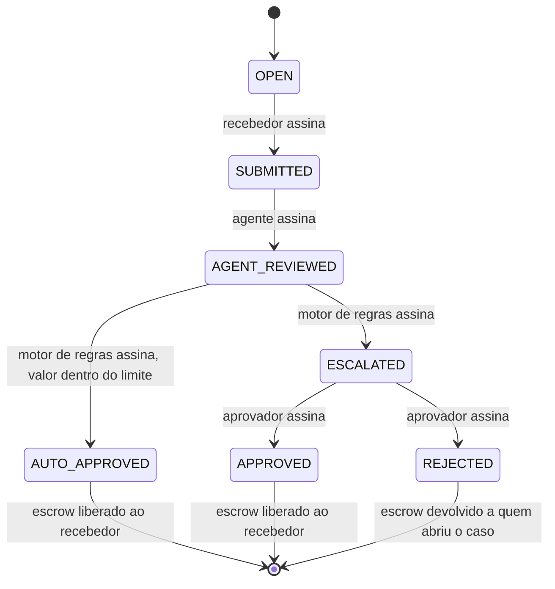
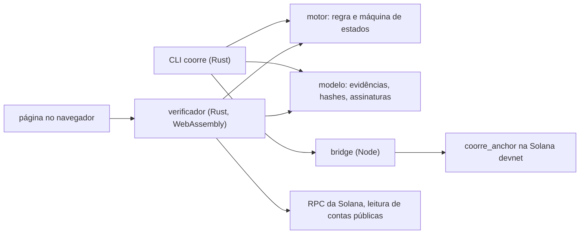

<h1 align="center">
<picture>
<source media="(prefers-color-scheme: dark)" srcset="docs/assets/hero-dark.svg">

</picture>
</h1>

<p align="center">


</p>

<p align="center"><a href="README.md">English</a> · <b>Português (Brasil)</b></p>

O agente age dentro do seu mandato, a regra decide e uma pessoa assina cada exceção. Na Solana, o programa impõe o limite e só libera um pagamento quando a decisão, sustentada por evidências, está ancorada. Qualquer pessoa pode verificar cada etapa sem precisar confiar em nós.

Construído para o Colosseum Crypto World's Fair, trilha Solana, pela watafluxhackteam.

## O problema

Os agentes de IA estão deixando de recomendar para passar a decidir: a Gartner prevê que pelo menos 15% das decisões do trabalho cotidiano serão tomadas de forma autônoma por IA agêntica até 2028, contra 0% em 2024 ([Gartner, junho de 2025](https://www.gartner.com/en/newsroom/press-releases/2025-06-25-gartner-predicts-over-40-percent-of-agentic-ai-projects-will-be-canceled-by-end-of-2027)). A governança não acompanha esse ritmo: 97% dos líderes no mundo e 95% no Brasil planejam adotar IA agêntica em até dois anos, mas só 21% no mundo e 27% no Brasil afirmam ter modelos de governança maduros ([Deloitte, State of AI in the Enterprise 2026](https://www.deloitte.com/br/pt/about/press-room/state-of-ai-2026.html)). E, sem controles, os projetos não avançam: a Gartner também prevê que mais de 40% dos projetos de IA agêntica serão cancelados até o fim de 2027 por custos crescentes, valor de negócio pouco claro ou controles de risco inadequados ([Gartner, junho de 2025](https://www.gartner.com/en/newsroom/press-releases/2025-06-25-gartner-predicts-over-40-percent-of-agentic-ai-projects-will-be-canceled-by-end-of-2027)). Além disso, um limite que vive em configuração pode ser desligado: no estudo de 2026 da ACFE sobre fraude ocupacional, a burla de controles internos existentes foi a principal fragilidade em 19% dos casos, e a ausência de controles internos, em 33% ([ACFE, 2026](https://www.acfe.com/report-to-the-nations)).

## O que precisa ser verdade

Só vale conceder autonomia quando ela pode ser limitada, revertida e auditada. O OWASP Top 10 for Agentic Applications já aponta agentes fora de controle e abuso de identidade e privilégios entre os principais riscos ([OWASP, dezembro de 2025](https://genai.owasp.org/2025/12/09/owasp-top-10-for-agentic-applications-the-benchmark-for-agentic-security-in-the-age-of-autonomous-ai/)). Daí seguem três condições:

- **Limitar o que um agente pode fazer.** O Model AI Governance Framework for Agentic AI, de Singapura, pede às organizações que avaliem e limitem os riscos desde o início, impondo limites ao que os agentes podem fazer, e que pesem cada ação pelo quanto ela é reversível ([IMDA, 2026](https://www.imda.gov.sg/resources/press-releases-factsheets-and-speeches/factsheets/2026/updated-model-ai-governance-framework-for-agentic-ai)).
- **Uma pessoa responde por cada exceção com impacto relevante.** O mesmo framework pede pontos de controle com aprovação humana para ações de alto risco ou irreversíveis, e inclui pagamentos entre elas. O AI Act da União Europeia exige que as pessoas que supervisionam um sistema de alto risco possam decidir não usá-lo, ignorar ou reverter seu resultado e interrompê-lo ([EU AI Act, artigo 14](https://artificialintelligenceact.eu/article/14/)).
- **Toda decisão automatizada pode ser explicada e conferida de novo.** A LGPD garante o direito de solicitar a revisão de decisões tomadas unicamente com base em tratamento automatizado e de receber informações claras sobre os critérios e procedimentos usados ([LGPD, artigo 20](https://www.planalto.gov.br/ccivil_03/_ato2015-2018/2018/lei/l13709.htm)). Em um estudo de campo com 75 iniciativas de IA em 22 empresas brasileiras, a tomada de decisões e o direcionamento das atividades formaram o maior grupo de gargalos, presente em 33% das iniciativas, e o estudo conclui que, quanto mais autonomia os agentes têm, mais precisam de controles, de registro de atividades e de supervisão humana; os autores afirmam que a amostra não é estatisticamente representativa ([StartSe Consulting, segundo a Mundo RH, outubro de 2026](https://mundorh.com.br/ia-nas-empresas-84-dos-projetos-analisados-apresentam-resultados-e-revelam-novos-desafios-para-o-rh/)).

## O que já existe e o que falta

Os trilhos de pagamento para agentes já existem. O Agent Payments Protocol (AP2), do Google, usa Mandates assinados criptograficamente, apoiados em credenciais verificáveis, como prova do que o usuário autorizou, inclusive limites de preço ([Google Cloud, setembro de 2025](https://cloud.google.com/blog/products/ai-machine-learning/announcing-agents-to-payments-ap2-protocol/?hl=en)). O x402 é um protocolo aberto de pagamentos que suporta a Solana mainnet e a devnet ([x402](https://docs.x402.org/faq)). Os Solana Payment Channels permitem que um agente deposite um teto de gastos em escrow on-chain e autorize cada requisição com uma mensagem assinada, em vez de uma transação ([Solana](https://solana.com/payment-channels)).

Esses trilhos respondem como um agente paga. Eles não provam que um pagamento que exigia julgamento foi decidido sob a regra certa, com a evidência certa, por alguém com autoridade para decidir. Essa é a camada que a CoorRe acrescenta. Ela complementa os trilhos: a decisão comprovada é o que um trilho pode executar.

## Como a CoorRe funciona

Cada caso é um pagamento retido em escrow e uma decisão que precisa ser comprovada antes que ele se mova.

| Papel | Quem | O que pode fazer |
|---|---|---|
| Recebedor | O fornecedor, prestador ou beneficiário a quem o pagamento é devido | Envia a evidência. Recebe o escrow quando a decisão é comprovada. |
| Agente de IA | Um agente de pré-análise | Lê a evidência e recomenda. Não pode aprovar nada nem mover fundos. |
| Motor de regras | Um sistema determinístico | Aplica a regra indicada na evidência e decide dentro do mandato. Acima do limite, o programa recusa a aprovação dele. |
| Aprovador humano | Uma pessoa designada, com autoridade | Assina cada exceção, aprovando ou rejeitando um caso escalado, com justificativa. |

1. **O agente recomenda.** Ele lê o que o recebedor enviou e registra sua recomendação, assinada com a própria chave.
2. **A regra decide dentro do mandato.** O motor de regras aplica uma regra determinística à evidência. Se todas as condições forem atendidas e o valor estiver dentro do limite de autonomia, o caso é aprovado e o escrow é liberado. Caso contrário, ele é escalado, com um motivo para cada condição não atendida.
3. **Uma pessoa assina a exceção.** Só a chave do aprovador pode levar um caso escalado a aprovado ou rejeitado. O programa confere cada signatário contra o papel registrado on-chain.

Cada etapa é uma W3C Verifiable Credential, o modelo de dados publicado como padrão W3C em maio de 2025 ([W3C, maio de 2025](https://lists.w3.org/Archives/Public/w3c-news/2025AprJun/0000.html)), assinada por quem age e ancorada na Solana pelo seu hash. Os documentos ficam fora da cadeia.

Na CoorRe, o dinheiro é sempre um pagamento devido por uma entrega ou por uma decisão. Ele fica em escrow quando o caso é aberto, é liberado ao recebedor quando a decisão é comprovada e ancorada, e volta para quem abriu o caso quando a decisão é uma rejeição. Não há negociação de ativos, precificação, ordens, mercados nem especulação. O pagamento é a consequência; o produto é a decisão comprovada.

## Um caso, de ponta a ponta

SUP-002 é o pagamento de 0,20 SOL a um fornecedor, em que a automação pode aprovar até 0,10 SOL. A licença ambiental do fornecedor está vencida. Esta é a sequência que rodou na Solana devnet, com dados sintéticos.

<p align="center">
<picture>
<source media="(prefers-color-scheme: dark)" srcset="docs/assets/flow-sup002-dark.svg">

</picture>
</p>

O laranja aparece duas vezes: quando o programa recusa uma aprovação acima do mandato e na assinatura humana, o único caminho para passar do limite.

## O que qualquer pessoa pode verificar

Cada etapa é uma credencial assinada cujo hash está ancorado na Solana. O verificador recebe um pacote com essas credenciais e os documentos originais, lê as contas na cadeia e executa sete checagens. Ele roda na linha de comando e no navegador, a partir do mesmo código Rust.

<p align="center">
<picture>
<source media="(prefers-color-scheme: dark)" srcset="docs/assets/verify-checks-dark.svg">

</picture>
</p>

| Checagem | O que comprova |
|---|---|
| 1. Digests dos artefatos | Cada arquivo corresponde ao hash que sua evidência declara. |
| 2. Hashes das evidências | Cada credencial gera exatamente o hash que foi ancorado. |
| 3. Assinaturas | Cada credencial traz uma prova Ed25519 válida (W3C eddsa-jcs-2022). |
| 4. Vínculo do signatário | A chave que assinou é a chave do papel registrada on-chain para aquela etapa. |
| 5. Cadeia de hashes | As etapas formam uma cadeia contínua do caso até seu estado final. |
| 6. Correspondência on-chain | As contas pertencem ao programa CoorRe e guardam exatamente os valores recalculados. |
| 7. Decisões reproduzidas | O verificador executa de novo a regra indicada na evidência, a partir do registro que ele traz, sobre os documentos enviados, e chega à decisão registrada. |

A checagem 7 fecha uma lacuna que a cadeia não consegue fechar: o programa impõe o valor contra o mandato, mas não lê documentos. Se um motor de regras comprometido aprovasse um caso com a licença vencida, as checagens 1 a 6 continuariam passando e a 7 falharia. O verificador só executa as regras que traz consigo: uma decisão que indique qualquer outra regra, versão ou hash falha na checagem 7. Veja a [ADR-004](docs/decisions/ADR-004-reproducible-automated-decisions.md) e a [ADR-005](docs/decisions/ADR-005-rule-registry-and-application-domains.md).

## Onde se aplica

O programa, os papéis, a máquina de estados e o modelo de evidências são os mesmos em todos os domínios. O que muda é a regra, e cada regra vem no registro do verificador com casos de demonstração sintéticos: um que passa e um que precisa do aprovador.

| Domínio | Quem age | Evidência | Regra | Autoridade humana | Base | Status |
|---|---|---|---|---|---|---|
| Homologação e pagamento de fornecedores | Fornecedor, agente de compras, motor de regras | Certidão fiscal, licença ambiental | supplier-docs v1 | Gestor de compras | [StartSe Consulting, 2026](https://mundorh.com.br/ia-nas-empresas-84-dos-projetos-analisados-apresentam-resultados-e-revelam-novos-desafios-para-o-rh/) | roda na devnet |
| Pagamentos por marco em projetos financiados, com prestação de contas | Organização beneficiária, agente de análise, motor de regras | Termo de fomento, relatório do marco, prestação de contas | milestone-payment v1 | Gestor do fundo | [Lei 13.019/2014, art. 48](https://www.planalto.gov.br/ccivil_03/_ato2011-2014/2014/lei/l13019compilado.htm) | roda na devnet |
| Pagamentos por serviços ambientais com evidência de monitoramento | Provedor no território, agente de monitoramento, motor de regras | Contrato, relatório de monitoramento | ecosystem-services-payment v1 | Gestor do programa | [Lei 14.119/2021, art. 6º, § 6º](https://www.planalto.gov.br/ccivil_03/_ato2019-2022/2021/lei/l14119.htm) | roda na devnet |
| Contratos de serviço entregues por consultorias | Consultoria, agente de análise, motor de regras | Contrato de serviço, termo de aceite, nota fiscal | service-delivery v1 | Gestor do contrato | [Lei 4.320/1964, arts. 62 e 63](https://www.planalto.gov.br/ccivil_03/leis/l4320.htm), quando o contratante é um órgão público | roda na devnet |
| Compras preparadas por agentes de IA | Fornecedor, agente de compras, motor de regras | Pedido de compra, cotação do fornecedor, cadastro do fornecedor | agent-purchase v1 | Gestor de compras | [AP2](https://cloud.google.com/blog/products/ai-machine-learning/announcing-agents-to-payments-ap2-protocol/?hl=en), [IMDA](https://www.imda.gov.sg/resources/press-releases-factsheets-and-speeches/factsheets/2026/updated-model-ai-governance-framework-for-agentic-ai), [StartSe Consulting](https://mundorh.com.br/ia-nas-empresas-84-dos-projetos-analisados-apresentam-resultados-e-revelam-novos-desafios-para-o-rh/) | roda na devnet |

**Pagamentos por serviços ambientais.** É aqui que o Re de CoorRe significa regenerativo; esse domínio nasce da W.A.T.A, o projeto anterior de pagamentos por serviços ambientais cofundado por Ramon Porto.

## Por dentro

<details>
<summary>Máquina de estados imposta pelo programa</summary>



Cada transição precisa ser assinada pela chave do papel responsável por ela. As quatro chaves de papel de um caso precisam ser distintas.

</details>

<details>
<summary>Registro de regras</summary>

Cada regra é um documento JSON em [offchain/crates/coorre-engine/rules](offchain/crates/coorre-engine/rules), compilado no motor e no verificador e identificado pelo SHA-256 da sua forma canônica. Uma regra só aprova quando todas as condições são atendidas; caso contrário, escala com um motivo para cada condição não atendida, na ordem em que a regra as lista, e a checagem do mandato vem sempre por último.

| Regra | Documentos | Casos de demonstração |
|---|---|---|
| supplier-docs v1 | certidão fiscal, licença ambiental | SUP-001, SUP-002, SUP-003 |
| agent-purchase v1 | pedido de compra, cotação do fornecedor, cadastro do fornecedor | AGT-001, AGT-002 |
| ecosystem-services-payment v1 | contrato, relatório de monitoramento | PES-001, PES-002 |
| milestone-payment v1 | termo de fomento, relatório do marco, prestação de contas | MIL-001, MIL-002 |
| service-delivery v1 | contrato de serviço, termo de aceite, nota fiscal | SRV-001, SRV-002 |

Os casos e seus documentos sintéticos estão descritos em [demo/fixtures](demo/fixtures/README.md).

</details>

<details>
<summary>Arquitetura</summary>



O núcleo em Rust não depende da Solana. A bridge em Node é o único componente que envia transações, e ela recusa qualquer rede que não seja a devnet. As evidências ficam fora da cadeia; só hashes e chaves públicas chegam a ela.

</details>

## Experimente

Você precisa de Rust (stable) e Node 20 ou mais recente. Estes comandos verificam um caso gravado na devnet contra a cadeia ao vivo. Não precisam de chaves nem de SOL.

```bash
git clone https://github.com/catitodev/CoorRe.git
cd CoorRe
npm ci --prefix bridge
cargo build --release --manifest-path offchain/Cargo.toml -p coorre-cli
offchain/target/release/coorre verify \
  --bundle web/verifier/samples/SUP-002/bundle.json \
  --artifacts web/verifier/samples/SUP-002/artifacts
```

O comando mostra as sete checagens e termina com status 1 se alguma falhar. Altere um byte de um arquivo da pasta artifacts e rode de novo para ver as checagens 1 e 7 falharem. O mesmo comando verifica as amostras AGT-002 e PES-002, gravadas na devnet sob agent-purchase v1 e ecosystem-services-payment v1.

Os outros quatro domínios também rodam offline, sem chaves e sem rede. Este teste passa os oito casos pelo simulador em memória, verifica cada um com 7/7 e confere que um byte alterado em qualquer documento faz as checagens 1 e 7 falharem:

```bash
cargo test --manifest-path offchain/Cargo.toml -p coorre-cli --test domains_offline
```

<details>
<summary>Rodar os testes e a demonstração</summary>

```bash
cargo test --manifest-path offchain/Cargo.toml --workspace
npm test --prefix bridge
npm test --prefix web/verifier
```

Os testes de `web/verifier` precisam antes do build em WebAssembly: `WASM_BINDGEN=/path/to/wasm-bindgen scripts/build-verifier`.

A demonstração narrada abre casos reais na devnet. Ela precisa de cinco arquivos de chave Solana em `.local/keys` (creator, submitter, agent, rule_engine, approver) com modo 600 e de algum SOL de devnet na chave creator:

```bash
offchain/target/release/coorre demo run
```

Com os mesmos arquivos de chave, qualquer caso roda narrado e offline, sem enviar nada a uma rede:

```bash
offchain/target/release/coorre demo run --offline --case AGT-002 --case MIL-002
```

</details>

## Prova on-chain

O programa está implantado na Solana devnet:

- Programa: [`9esN1A8K1SASLg17ob81dbSdB4VX8ozc6tBLmJ247Wv`](https://explorer.solana.com/address/9esN1A8K1SASLg17ob81dbSdB4VX8ozc6tBLmJ247Wv?cluster=devnet)
- Transação de implantação: [`2ku5UxeT…`](https://explorer.solana.com/tx/2ku5UxeTyM1qrVcKhB3s68pDVh2cZyyTpFXuhF8orWjzvswoCguiN5AjoLAAvbxLbG6yRBDHvxgAFYKzcsq7JJxY?cluster=devnet)

<details>
<summary>Transações do caso SUP-002</summary>

| Etapa | Transação |
|---|---|
| OPEN, 0,20 SOL em escrow | [`rBt7urt2…`](https://explorer.solana.com/tx/rBt7urt2sexKvv4kYWKfXCam54wxJsq46Zjs8hiV1HL2rWt8VJMMQKW8BB4HGxiMbirGzofe4CzHLbLh5GhascB?cluster=devnet) |
| SUBMITTED | [`3eduiGPv…`](https://explorer.solana.com/tx/3eduiGPv3z2KbVNicNovUKYcvJn5UYMEhhhRcwsNB7g9D8bDNpWgT8JPy2sbqmZwK4ujEaGuX4WmkM577JUEy8LN?cluster=devnet) |
| AGENT_REVIEWED | [`4tb5Us6g…`](https://explorer.solana.com/tx/4tb5Us6gM4dMkyHrFSVLBXWDme5ATisEW5QADx5NRibGeZb4fMg5HG6exgX4cyCpNADV6JAUVrPzZLUo4YwzpxZi?cluster=devnet) |
| AUTO_APPROVED tentado acima do limite | Recusado pelo programa com `MandateExceeded`. Nenhuma transação existe. |
| ESCALATED | [`3zQBE5sY…`](https://explorer.solana.com/tx/3zQBE5sYP5GyqazDYLh445kPeCWmWDBewRHFYsNjJKWye8Q28nFDeMnL4whmmWzmDTPwfZqXxgbZAdg3ZySmNQd2?cluster=devnet) |
| APPROVED, escrow liberado | [`2nQ2pHJ7…`](https://explorer.solana.com/tx/2nQ2pHJ7ACi6LQeNSzDAhM2N2ji9kkAZEmgsfTghSNNToQizXVXwkZiR3Ejiz2jwmiz8FUZMR3hG6RUDW1aapfYc?cluster=devnet) |

Mais detalhes da implantação e o caso SUP-001 estão em [onchain/DEPLOYMENTS.md](onchain/DEPLOYMENTS.md).

</details>

<details>
<summary>Casos dos outros quatro domínios (devnet, 2026-10-10)</summary>

| Caso | Regra | Registro do caso | Etapa final |
|---|---|---|---|
| AGT-001 | agent-purchase v1 | [`HFkXBQAZ…`](https://explorer.solana.com/address/HFkXBQAZsR5fv9ydjUHGhSzjcbxi4qFNAdz3tVoguVDV?cluster=devnet) | AUTO_APPROVED, escrow liberado: [`3rTeiVAQ…`](https://explorer.solana.com/tx/3rTeiVAQN8MbEKrGJ5E9f1zbhd2tRLHqG35uDuGkLmcZAMTWpK5WfczpfpxysZ4htvevSN1qksPac3QYmkVvJFkY?cluster=devnet) |
| AGT-002 | agent-purchase v1 | [`4tkhyE96…`](https://explorer.solana.com/address/4tkhyE96rDPd3hCZvxge8i5sYNGmkH4SAsdK5SgJFeQz?cluster=devnet) | APPROVED, escrow liberado: [`NmdtA5YR…`](https://explorer.solana.com/tx/NmdtA5YRW1nBTmiBqEQJSpitnMQyQLpUZXSGNUTFJ6fSQR9WTXtkrEM54drMT3tavcFvxV221SFpPN9icqGvBmn?cluster=devnet) |
| PES-001 | ecosystem-services-payment v1 | [`6VKegWgg…`](https://explorer.solana.com/address/6VKegWgguGwfoqpSkgWYCViqPjsvwqv5uX4vRFbVRGsT?cluster=devnet) | AUTO_APPROVED, escrow liberado: [`3uzkLCcM…`](https://explorer.solana.com/tx/3uzkLCcMmUUUkbPT3fGwmYHAr9vyxjG3zh3URbw1bP7iF6AM3WN56ePcJVUv7cdrHvAGZ3hu1DSHWg9eRVwm8LSY?cluster=devnet) |
| PES-002 | ecosystem-services-payment v1 | [`Fg7PbduC…`](https://explorer.solana.com/address/Fg7PbduC8r5KWM8WkRxqsDXfyHoqkBjM9HCaCe8csAF1?cluster=devnet) | APPROVED, escrow liberado: [`5WrgY3n5…`](https://explorer.solana.com/tx/5WrgY3n5ViURcBRiwV1jQvBkj2NPDevy4p6SVWyr8kVUQwMmi819yxQXAUYFxaw1jcemKRPTJrQwLPvdGLsurPLx?cluster=devnet) |
| MIL-001 | milestone-payment v1 | [`EJutNMDd…`](https://explorer.solana.com/address/EJutNMDdpkjw72S5mMbXqgkuwjjF9y7jNYgUaicLLbFJ?cluster=devnet) | AUTO_APPROVED, escrow liberado: [`5TMsTFEN…`](https://explorer.solana.com/tx/5TMsTFENPinNkwqeGLP6DPQJgAEyo2JNXgDxGQSoKTb7SPuvxGdJSsqwdQj64B1ekgXoWVnwV53EisF5FuJScEt3?cluster=devnet) |
| MIL-002 | milestone-payment v1 | [`G46pdzcf…`](https://explorer.solana.com/address/G46pdzcfhWgSJhiNvV36sxGussmWJ7kwaoRd3QDFpmRL?cluster=devnet) | REJECTED, escrow devolvido: [`5rW4veHJ…`](https://explorer.solana.com/tx/5rW4veHJEtHiDHsQJphtp8TtvUpSyLYBMLAGBbDCbyZYLXQVUwc91fjqsqi9yNUKa4G4MAC9BodBi1PS2Gd6vrDF?cluster=devnet) |
| SRV-001 | service-delivery v1 | [`CzWgCr1H…`](https://explorer.solana.com/address/CzWgCr1HtwrHzC1Wwy4CGmkDeC6CaDrtWykrWhct9zSb?cluster=devnet) | AUTO_APPROVED, escrow liberado: [`2JMRXjZ6…`](https://explorer.solana.com/tx/2JMRXjZ6sRHqCKJN5p4nMAxnyESL8tgLLRqiEyQ8WJPQkaB3HaDs33TFE1DkQVqFvSU6jXosQLWDebV98YRySeAb?cluster=devnet) |
| SRV-002 | service-delivery v1 | [`DNPDxAje…`](https://explorer.solana.com/address/DNPDxAjex72NgF9xKRZdLzvywMtmBUWDU2wcTZhGzSLm?cluster=devnet) | REJECTED, escrow devolvido: [`3FV3ThfP…`](https://explorer.solana.com/tx/3FV3ThfPDWuvyND9LfF8kr1XJaWFPTbgmCr2jMthh28U9NJBfek3M8TGheLK3G7pLzcizEoKfQcrCLzMnhg9Wpa4?cluster=devnet) |

AGT-002 e PES-002 também mostram o programa recusando uma aprovação acima do mandato com `MandateExceeded` antes de o caso ser escalado. Todas as etapas e os saldos estão em [onchain/DEPLOYMENTS.md](onchain/DEPLOYMENTS.md). Os pacotes de auditoria dos oito casos estão no repositório, prontos para o `coorre verify`: AGT-002 e PES-002 em [web/verifier/samples](web/verifier/samples), os outros seis em [onchain/devnet-bundles](onchain/devnet-bundles/README.md).

</details>

## Sinal de mercado

A Gartner prevê que, até 2030, as tecnologias de guardian agents, criadas para supervisionar o que os agentes de IA fazem, responderão por pelo menos 10 a 15% dos mercados de IA agêntica ([Gartner, junho de 2025](https://www.gartner.com/en/newsroom/press-releases/2025-06-11-gartner-predicts-that-guardian-agents-will-capture-10-15-percent-of-the-agentic-ai-market-by-2030)). Ela também espera que os gastos com governança de IA cheguem a US$ 492 milhões em 2026 e passem de US$ 1 bilhão até 2030 ([Gartner, fevereiro de 2026](https://www.gartner.com/en/newsroom/press-releases/2026-02-17-gartner-global-ai-regulations-fuel-billion-dollar-market-for-ai-governance-platforms)); os dois números sinalizam que a categoria existe, não o tamanho do mercado da CoorRe.

## Segurança e limites

O modelo de ameaças, os controles e a revisão de dependências estão em [docs/SECURITY.md](docs/SECURITY.md). Os pontos principais:

- O mandato é imposto pelo programa, então nenhum operador, servidor ou agente consegue aprovar acima dele.
- As regras são determinísticas, e o verificador só executa as regras que traz consigo: uma decisão que indique qualquer outra regra, versão ou hash falha na checagem 7.
- O verificador nunca tira do próprio pacote em análise qual programa esperar.
- O conteúdo do pacote não é confiável: o verificador no navegador o exibe apenas como texto e roda sob uma política de segurança de conteúdo estrita.
- A bridge e o CLI recusam qualquer rede que não seja a devnet e recusam arquivos de chave legíveis por outros usuários.

Limites declarados desta versão:

- Só devnet, nunca mainnet. As chaves da demonstração ficam com o operador.
- O agente de IA é simulado e determinístico. Nenhum modelo de linguagem é chamado.
- Todos os documentos dos domínios são sintéticos. A checagem 7 prova que uma decisão segue a regra, não que um documento é autêntico.
- Sem build verificável e sem fuzzing. O RPC público da devnet limita requisições.
- A autoridade de upgrade do programa é uma única carteira. O alvo de produção é um multisig Squads.

## Roadmap

- Autoridade de upgrade sob um multisig Squads.
- Ancoragem em lote por raízes de Merkle.
- Solana Actions e Blinks para as decisões do aprovador.
- Pagamentos no estilo x402 para agentes.
- Documentos assinados por um emissor ou registro real.
- Integração com os trilhos de pagamento para agentes (AP2, x402, Solana Payment Channels) como camada de decisão.

## Perguntas frequentes

<details>
<summary>A CoorRe é um protocolo de trading ou de DeFi?</summary>

Não. Na CoorRe, o dinheiro é sempre um pagamento devido por uma entrega ou por uma decisão: fica em escrow quando o caso é aberto, é liberado ao recebedor quando a decisão é comprovada e ancorada, e volta para quem abriu o caso quando a decisão é uma rejeição. A CoorRe não negocia, não precifica, não recebe ordens, não opera mercados nem especula.

</details>

<details>
<summary>Por que on-chain?</summary>

Porque o limite precisa valer mesmo se o operador, o servidor ou o agente forem comprometidos. O programa recusa uma aprovação acima do mandato, algo que um banco de dados ou uma API não conseguem garantir. A cadeia também dá a cada etapa um registro público com data e hora que nenhuma parte sozinha pode reescrever.

</details>

<details>
<summary>O que o agente de IA faz, na prática?</summary>

Ele lê os documentos enviados e registra uma recomendação: escalar ou aprovar automaticamente. Ele não pode aprovar nem liberar nada. Nesta versão, ele é simulado e determinístico: executa a mesma regra do motor de regras e nenhum modelo de linguagem é chamado. Um agente real pode substituí-lo depois; a checagem 7 compara a recomendação dele com a regra, e essa recomendação continua sem mover fundos.

</details>

<details>
<summary>Posso verificar sem rodar nada?</summary>

Sim, com o verificador no navegador em [web/verifier](web/verifier), depois que ele for publicado no GitHub Pages. Até lá, você pode rodá-lo localmente ou usar o comando em Experimente.

</details>

<details>
<summary>Qual a diferença em relação a AP2, x402 ou Solana Payment Channels?</summary>

Eles movem o dinheiro e provam o que um usuário autorizou um agente a gastar. A CoorRe prova a decisão por trás de um pagamento que exige julgamento: qual regra se aplicou, a qual evidência e quem assinou a exceção. Os dois se encaixam, com a decisão comprovada como o gatilho sobre o qual um trilho de pagamento age; essa integração está no roadmap.

</details>

<details>
<summary>Por que a lei importa aqui?</summary>

Porque, em muitos processos, a lei já condiciona o pagamento a uma prova. No Brasil, a despesa pública só é paga depois que o direito do credor é verificado com base no contrato e no comprovante da entrega ou da prestação efetiva do serviço ([Lei 4.320/1964, arts. 62 e 63](https://www.planalto.gov.br/ccivil_03/leis/l4320.htm)), os pagamentos por serviços ambientais no programa federal dependem de verificação e comprovação das ações ([Lei 14.119/2021, art. 6º, § 6º](https://www.planalto.gov.br/ccivil_03/_ato2019-2022/2021/lei/l14119.htm)) e as parcelas repassadas a organizações da sociedade civil ficam retidas quando há evidência de irregularidade em uma parcela anterior ([Lei 13.019/2014, art. 48](https://www.planalto.gov.br/ccivil_03/_ato2011-2014/2014/lei/l13019compilado.htm)). A CoorRe transforma essas exigências em regras que uma máquina aplica, que uma pessoa assina quando não são atendidas e que qualquer um pode conferir de novo.

</details>

## Equipe e nome

A CoorRe é construída e pertence a seus dois cofundadores, Clarkson Bartalini ([@catitodev](https://github.com/catitodev)), líder técnico, e Ramon Porto ([@ramonzitus](https://github.com/ramonzitus)), cofundador. A equipe do hackathon é a watafluxhackteam.

Especialistas em meio ambiente e governança que constroem a própria tecnologia: provar o que aconteceu faz parte do seu trabalho diário em monitoramento e prestação de contas.

Ramon Porto cofundou a W.A.T.A, um projeto anterior de pagamentos por serviços ambientais que foi um dos cinco vencedores da trilha DLT for Operations do [2025 Hedera Africa Hackathon](https://africa.com/2025-hedera-africa-hackathon-announces-winners-officially-becomes-the-largest-web3-hackathon-globally/). Clarkson Bartalini juntou-se a ele para construir o MVP e liderar o desenvolvimento da solução. A proposta da CoorRe foi selecionada entre 200 de 1.053 ideias na Fase 1 do [Centelha RJ III](https://www.faperj.br/?id=1100.7.8) (lista preliminar, setembro de 2026).

O nome é Coor(denação) + Re. Re significa registro e, para parceiros da economia regenerativa, regenerativo.

Nenhum código existia antes de 2026-10-07. O primeiro commit é de 2026-10-08 e todo o histórico é público. O [docs/evidence/EVIDENCE_LOG.md](docs/evidence/EVIDENCE_LOG.md) registra cada etapa com sua data.

## Documentação

- [Especificação](docs/spec/SPEC.md)
- [Notas de segurança e modelo de ameaças](docs/SECURITY.md)
- Decisões: [ADR-001](docs/decisions/ADR-001-shared-codes-and-encodings.md), [ADR-002](docs/decisions/ADR-002-verifier-trust-anchors.md), [ADR-003](docs/decisions/ADR-003-demo-actors-and-case-references.md), [ADR-004](docs/decisions/ADR-004-reproducible-automated-decisions.md), [ADR-005](docs/decisions/ADR-005-rule-registry-and-application-domains.md)
- [Implantações e resultados na devnet](onchain/DEPLOYMENTS.md)
- [Ativos da marca](docs/assets/brand.md)

A documentação técnica é mantida em inglês.

## Fontes

1. Gartner, "Gartner Predicts Over 40% of Agentic AI Projects Will Be Canceled by End of 2027", comunicado à imprensa, 25 de junho de 2025. <https://www.gartner.com/en/newsroom/press-releases/2025-06-25-gartner-predicts-over-40-percent-of-agentic-ai-projects-will-be-canceled-by-end-of-2027>
2. Deloitte, "State of AI in the Enterprise 2026", comunicado à imprensa (3.235 líderes de negócios e TI, 115 no Brasil, pesquisa de agosto a setembro de 2025; a página não traz data de publicação). <https://www.deloitte.com/br/pt/about/press-room/state-of-ai-2026.html>
3. ACFE, "Occupational Fraud 2026: A Report to the Nations", 2026, figura 37. <https://www.acfe.com/report-to-the-nations>
4. OWASP GenAI Security Project, "OWASP Top 10 for Agentic Applications", 9 de dezembro de 2025. <https://genai.owasp.org/2025/12/09/owasp-top-10-for-agentic-applications-the-benchmark-for-agentic-security-in-the-age-of-autonomous-ai/>
5. Infocomm Media Development Authority (IMDA), Singapura, "Updated Model AI Governance Framework for Agentic AI", ficha informativa, 20 de maio de 2026 (framework lançado em janeiro de 2026). <https://www.imda.gov.sg/resources/press-releases-factsheets-and-speeches/factsheets/2026/updated-model-ai-governance-framework-for-agentic-ai>
6. União Europeia, Artificial Intelligence Act, artigo 14, supervisão humana. <https://artificialintelligenceact.eu/article/14/>
7. Brasil, Lei 13.709/2018 (LGPD), artigo 20. <https://www.planalto.gov.br/ccivil_03/_ato2015-2018/2018/lei/l13709.htm>
8. StartSe Consulting, "IA nas Trincheiras 2026", segundo a Mundo RH, 6 de outubro de 2026 (75 iniciativas, 78 agentes, 22 empresas, 15 setores; amostra não estatisticamente representativa). <https://mundorh.com.br/ia-nas-empresas-84-dos-projetos-analisados-apresentam-resultados-e-revelam-novos-desafios-para-o-rh/>
9. Google Cloud, "Powering AI commerce with the new Agent Payments Protocol (AP2)", 16 de setembro de 2025. <https://cloud.google.com/blog/products/ai-machine-learning/announcing-agents-to-payments-ap2-protocol/?hl=en>
10. x402, FAQ. <https://docs.x402.org/faq>
11. Solana, Payment Channels. <https://solana.com/payment-channels>
12. W3C, "W3C publishes Verifiable Credentials 2.0 as a W3C Standard", 15 de maio de 2025. <https://lists.w3.org/Archives/Public/w3c-news/2025AprJun/0000.html>
13. Brasil, Lei 13.019/2014, artigo 48, na redação da Lei 13.204/2015. <https://www.planalto.gov.br/ccivil_03/_ato2011-2014/2014/lei/l13019compilado.htm>
14. Brasil, Lei 14.119/2021, artigo 6º, § 6º. <https://www.planalto.gov.br/ccivil_03/_ato2019-2022/2021/lei/l14119.htm>
15. Brasil, Lei 4.320/1964, artigos 62 e 63. <https://www.planalto.gov.br/ccivil_03/leis/l4320.htm>
16. Gartner, "Gartner Predicts that Guardian Agents will Capture 10-15% of the Agentic AI Market by 2030", comunicado à imprensa, 11 de junho de 2025. <https://www.gartner.com/en/newsroom/press-releases/2025-06-11-gartner-predicts-that-guardian-agents-will-capture-10-15-percent-of-the-agentic-ai-market-by-2030>
17. Gartner, "Global AI Regulations Fuel Billion-Dollar Market for AI Governance Platforms", 17 de fevereiro de 2026. <https://www.gartner.com/en/newsroom/press-releases/2026-02-17-gartner-global-ai-regulations-fuel-billion-dollar-market-for-ai-governance-platforms>
18. Africa.com, "2025 Hedera Africa Hackathon Announces Winners, Officially Becomes The Largest Web3 Hackathon Globally". <https://africa.com/2025-hedera-africa-hackathon-announces-winners-officially-becomes-the-largest-web3-hackathon-globally/> (a página lista a W.A.T.A entre os cinco vencedores da trilha DLT for Operations e não traz data de publicação).
19. FAPERJ, "FAPERJ divulga lista preliminar de empresas aprovadas na Fase 1 do Programa Centelha RJ III", 1º de setembro de 2026. <https://www.faperj.br/?id=1100.7.8>

## Licença

Apache-2.0. Veja [LICENSE](LICENSE) e [NOTICE](NOTICE).

A camada de verificação deste repositório (programa on-chain, modelo de evidências, verificador e bridge) é open source sob a licença Apache-2.0, para que qualquer pessoa possa confiar nela e compô-la. A plataforma CoorRe (orquestração de casos, autoria de regras, pacotes de regras por domínio, integrações e o serviço hospedado) está planejada como o produto comercial da empresa.
